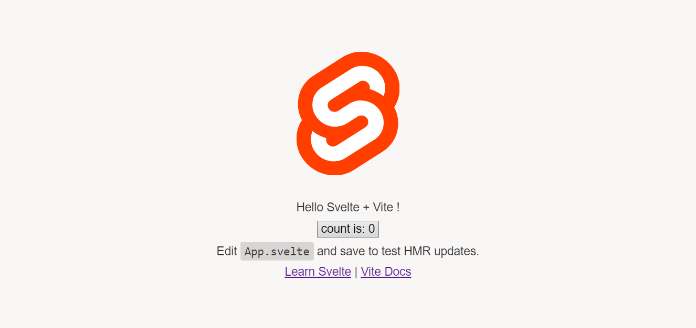

# Svelte Vite Template

> Vite starter template for Svelte.

This is a starter [Svelte.js](https://svelte.dev) template bundled with [Vite](https://vitejs.dev).



Included features :

- Linting with [Prettier](https://prettier.io/)
- Module bundling with [Vite](https://vitejs.dev)
- Deleting directories with [Rimraf](https://github.com/isaacs/rimraf)

## Clone template

In an empty folder run `npx degit adwinmbd/svelte-vite-template#main`

## Install:

```
npm install
```

## To run:

```
npm start
```

Open browser on [http://localhost:3000](http://localhost:3000) to view the app.

## To build:

```
npm run build
```

## To clean:

```
npm run clean
```

## To lint code:

```
npm run lint
```

## To style code:

```
npm run format
```
